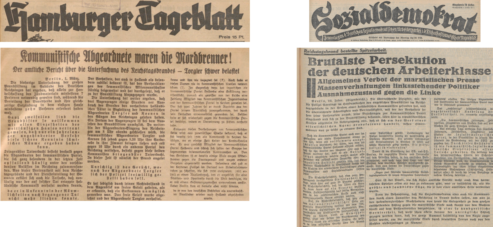
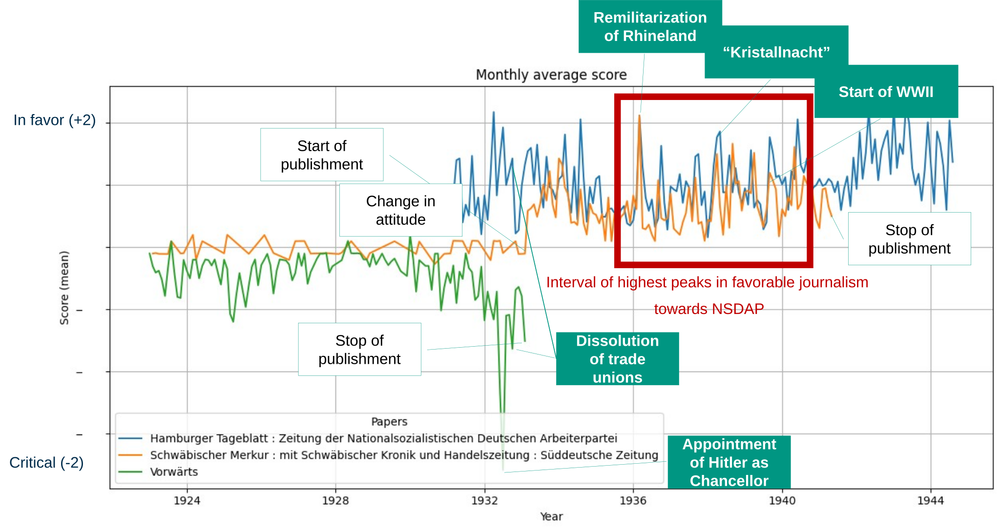

# Abstract

The role of journalism in shaping public opinion—especially in politically volatile contexts—has become a renewed subject of debate in light of current concerns over misinformation, media accountability, and the influence of platform ownership. These contemporary issues provide a valuable lens for reexamining the historical function of the press. In this project, we analyze how German newspapers responded to the political transformation leading up to the Nazi regime in the early 1930s. Drawing on the Deutsches Zeitungsportal, a large archive of digitized historical newspapers, we employ Large Language Models (LLMs) to automatically classify articles based on their stance toward the NSDAP. This computational approach reduces the need for manual content analysis and enables large-scale pattern discovery. The project was inspired by a personal interest in journalism and the discovery of contradictory reporting on the 1933 arrest of an SPD politician, underscoring the value of using digital methods to explore the complex and often polarized media landscape of that era.

# Introduction/Motivation

On January 20, 2025, during the second inauguration of Donald Trump in Washington D.C., businessman and political figure Elon Musk made a gesture that quickly sparked global controversy. This is because Musk's gesture falls under the definition of a Nazi salute: raising the right arm, outstretched, palm down.

<figure>
  <p><a href="[https://www.deutsche-digitale-bibliothek.de](https://www.theguardian.com/technology/2025/jan/20/trump-elon-musk-salute)">
    
  </a></p>
  <figcaption>
    <p>'Elon Musk appears to make back-to-back fascist Salutes' (The Guardian, 2025)
  </figcaption>
</figure>

While some claimed Musk was invoking the Roman salute, prominent media outlets and public discourse, particularly in Germany, left little doubt about the gesture’s connotation. As the New York Times noted, “In Germany, there was little doubt about [Elon Musk’s salute’s] meaning.” The incident gained further visibility because the ensuing debate unfolded on Musk’s own platform, X, which by then had over 400 million users and was frequently criticized for hosting hate speech and misinformation (The Guardian, 2025). 

For many Germans, the moment triggered familiar discomfort. It reminded us of a promise made in school—when, in 8th-grade history lessons, we collectively chanted “Nie wieder” (“Never again”). This phrase symbolized our country’s post-war commitment to learn from history, to protect democracy, and to never allow the conditions that led to fascism and war to return. We understand that not every German in the 1930s was a Nazi—but history has shown that silence, complicity, and media manipulation contributed to the dismantling of democracy and the rise of dictatorship. Today, similar warning signs are visible in many democracies: the growing influence of the far right, erosion of democratic norms, the remilitarization of international politics, and the weakening of public discourse. This research project aims to apply data science methods to a historical dataset in order to understand how journalism responded to the rise of authoritarianism in the past—and what lessons this might offer for today. While we make no causal claims, our hypothesis is that patterns of press alignment and suppression can be observed through careful computational analysis of historical media.

# Historical background

A particularly illustrative case occurred on February 27, 1933: the Reichstag fire. As Germany approached critical elections, the German parliament building burned down. Authorities blamed the act on Marinus van der Lubbe, a Dutch communist who confessed under interrogation. However, the National Socialist German Workers' Party (NSDAP) framed the event as evidence of a broader communist conspiracy. The next day, President Paul von Hindenburg signed the Reichstag Fire Decree, suspending civil liberties and enabling mass arrests, particularly targeting communists. Among the arrested was Ernst Torgler, a Reichstag member from the Communist Party (KPD), who turned himself in despite opposition from party leadership.

The reporting in newspapers of that time on the arrest of Torgler differed significantly. NSDAP-aligned newspapers, such as the Hamburger Tageblatt, presented Ernst Torgler as a key suspect in the Reichstag fire, citing alleged eyewitness testimonies and framing his arrest as proof of communist involvement. By casting the communists as an immediate threat, the NSDAP sought to boost its own popularity and rally public support behind its policies. In contrast, newspapers closely connected to left-leaning parties, such as the Sozialdemokrat, focused more on the repression of communists and their organizations. Furthermore, the Sozialdemokrat criticized the involvement of the NSDAP organizations SA and SS within the Reichspolizei. From these differing reports, it is possible to derive an impression of a newspaper’s stance toward the NSDAP.

<figure>
  <p><a href="https://www.deutsche-digitale-bibliothek.de">
    
  </a></p>
  <figcaption>
    <p>Excerpt from the newspapers Hamburger Tagblatt and Sozialdemokrat (01. March 1933)
  </figcaption>
</figure>


<div style="display: flex; gap: 10px;">
  <div style="flex: 1; background-color: #002D4C; color: white; padding: 10px; border: 1px solid #002D4C; border-radius: 4px;">
    <strong>Excerpt from the Hamburger Tagblatt newspaper:</strong> <br> 
    „Die Untersuchung hat weiter ergeben, daß drei Augenzeugen einige Stunden vor Ausbruch des Brandes den verhafteten holländischen Täter in Begleitung der kommunistischen Abgeordneten Torgler und Koenen in den Gängen des Reichstages gesehen haben.
    Ein Irrtum der Augenzeugen ist bei dem Aussehen des Brandstifters unmöglich. Da weiterhin der Abgeordneten-Eingang des Reichstages um 8 Uhr abends geschlossen wird, die kommunistischen Abgeordneten Torgler und Koenen sich jedoch gegen 8.30 Uhr ihre Garderobe in ihre Zimmer bringen ließen und erst gegen 10 Uhr durch ein anderes Portal den Reichstag verließen, besteht gegen diese beiden Kommunisten dringender Tatverdacht. In dieser Zeit ist nämlich der Brand angelegt worden.“ <br>
    <a href="https://www.deutsche-digitale-bibliothek.de/newspaper/item/Y353SVCH47W4O2ARVT2OCCFV3RPVCFRL?issuepage=3" >
      Hamburger Tagblatt
    </a>
  </div>

  <div style="flex: 1; background-color: #002D4C; color: white; padding: 10px; border: 1px solid #002D4C; border-radius: 4px;">
    <strong>Excerpt from the Sozialdemokrat newspaper:</strong> <br>
    "Damit ist die Einreihung der SA- und SS-Banden, die ungezählte Morde und Terrorakte auf dem Gewissen haben, in den amtlichen Polizeiapparat mundgerecht gemacht. Und nun kommt der Hauptschlag gegen die marxistische Linke: Gegen führende kommunistische Reichstagsabgeordnete wurde wegen angeblichen Tatverdachts Haftbefehl erlassen, die übrigen Abgeordneten und Funktionäre der Partei wurden in Schutzhast genommen. Das ‚rechtfertigt‘ selbstverständlich die ungeheuerlichste Knebelung der Pressefreiheit, denn sämtliche kommunistischen Zeitungen, Zeitschriften, Flugblätter und Plakate sind verboten. Zudem trifft die Notverordnung ‚zum Schutz von Volk und Staat‘, die praktisch dem Standrecht gleichkommt, die gesamte Arbeiterbewegung, indem sie mit Terror, Verboten und Todesstrafe jeden Widerstand ersticken soll." <br>
    <a href="https://www.deutsche-digitale-bibliothek.de/newspaper/item/YGFEXVVB2W6EJGDT4ZJUOJRJL6VDRPZ4?issuepage=1" >
      Sozialdemokrat
    </a>
  </div>
</div>

<br>

# The role of digital archives

To analyze these differences at scale, we turned to the [Deutsches Zeitungsportal](https://www.deutsche-digitale-bibliothek.de/newspaper), a service of the German Digital Library that provides free access to historical newspapers collected from German cultural and scientific institutions. The portal currently hosts more than 1,931 newspaper titles comprising over 25 million pages, with particularly rich coverage of the early 20th century. 

<figure>
  <p><a href="https://www.deutsche-digitale-bibliothek.de/assets/dzp-logo-lg-rgb-ef2b5467392b95453fad9602155430d8.svg">
    
  </a></p>
  <figcaption>
    <p>Logo of the "Deutsches Zeitungsportal"
  </figcaption>
</figure>


This rich data source allows for multiple potential analyses, providing, for example, deeper insights into the general public portrayal of political events. However, utilizing such large amounts of data involves an an overwhelming amount of manual effort if done by humans. This is where Large Language Models come in handy. These models are capable of understanding textual context and thus can be utilized to assist in analyzing large numbers of news articles.

While this archive offers incredible potential, analyzing millions of articles manually is infeasible. This is where modern Large Language Models (LLMs) offer new opportunities. These models can interpret textual meaning and context, allowing us to estimate how newspapers reported on the NSDAP over time. By quantifying stance—without the need for exhaustive manual classification—we can identify patterns across time and publications that reflect the evolving political climate.

# Project focus

This project investigates how historical newspapers positioned themselves toward the NSDAP during its rise to power in the 1930s. Our aim is not to reinterpret historical facts, but to develop a computational method for detecting press alignment through text classification using LLMs. This allows us to observe shifts in sentiment over time and between outlets—especially in reaction to key political events.
The combination of natural language processing, knowledge graph integration (e.g., historical events from WikiData), and digital cultural archives exemplifies how data science can enrich historical research. As we reexamine journalism’s role in shaping political narratives, we are also reminded that the questions posed by the past—about freedom of expression, bias, and responsibility—remain pressing today.

# Research questions

The Data Story research questions are separated into three different questions:

1. Do newspapers with different political affiliations exhibit distinct stance trajectories toward the NSDAP over time?
2. How did the stance of major German newspapers toward the NSDAP change before and after the party’s rise to power in 1933?
3. Which key historical events correlate with significant shifts in newspaper sentiment toward the NSDAP across different publications?


# Methodology& Implementation

The following subsections outline the technical and analytical approach used to assess newspaper articles for their stance toward the NSDAP. After filtering the dataset to identify consistently active newspapers, articles are sampled and analyzed using a large language model. The methodology section details data access and filtering strategies, model selection criteria, and prompt design. Additionally, historical events from WikiData are later aligned with these stance scores to contextualize shifts in sentiment over time.

## Methodology

Currently, there is no SPARQL endpoint in the NFDI4Culture environment for data coming from the [Deutsche Zeitungsportal](https://www.deutsche-digitale-bibliothek.de/newspaper). We therefore call the [DDB API](https://github.com/Deutsche-Digitale-Bibliothek/ddblabs-ddbapi) to access the data. To initially analyze the data and its size, we download all articles published between 1920 and 1945. The full corpus of articles from this period comprises over 160 gigabytes of text, excluding the digitized source materials from which the text was extracted using Optical Character Recognition (OCR). To focus only on relevant data, the downloaded data is then filtered using Pandas Python code. Pandas is a powerful Python library enabling users to process, analyze, and visualize large amounts of data. The refined data is subsequently used to call the large language model of the Mistral AI API (`mistral-small-2506`), which interprets the news articles for stance towards the NSDAP.

<figure>
  <p><a>
    
  </a></p>
  <figcaption>
    <p>Overview of data flow
  </figcaption>
</figure>

## Set Up and Implementation

This section describes how the newspaper dataset was narrowed down to a refine subset. It begins with the filtering criteria used to select consistently active newspapers, followed by a description of the sampled articles. The final parts explain how large language models were applied to assess stance towards NSDAP and how external historical event data was integrated to support the analysis.

### Filters

To refine the dataset to the most consistently active and prolific publishers, only newspapers that were in continuous operation for at least 12 years and published a minimum of 500 articles per year were retained. We chose 12 years since this is the period between the beginning of the data (1920) and the seizure of power by the NSDAP (1933).

Applying these criteria resulted in a selection of 101 newspapers, representing a total data volume of over 29 gigabytes.

<details>
<summary>List of 101 newspapers:</summary>

<br>

1. Sauerländisches Volksblatt : aeltester Anzeiger des Sauerlandes : ueber 100 Jahre Heimat- und Kreisblatt im Kreise Olpe : Tageszeitung für Politik, Unterhaltung und Belehrung <br>
2. Riesaer Tageblatt und Anzeiger : (Elbeblatt und Anzeiger) : amtliche Bekanntmachungen für die Stadt und den Landkreis Riesa <br>
3. Frankenberger Tageblatt, Bezirks-Anzeiger : Amtsblatt für die königliche Amtshauptmannschaft Flöha, das königliche Amtsgericht und den Stadtrat zu Frankenberg i. Sa <br>
4. Der Grafschafter. 1914-1945 <br>
5. Schwäbischer Merkur : mit Schwäbischer Kronik und Handelszeitung : Süddeutsche Zeitung <br>
6. Wittener Tageblatt : verbunden mit der Annener Zeitung <br>
7. Velberter Zeitung : Nevigeser Volkszeitung : Heiligenhauser Zeitung <br>
8. Rheinisches Volksblatt : Hildener Zeitung und Tageblatt : Hildener Rundschau <br>
9. Gießener Anzeiger : General-Anzeiger für Oberhessen <br>
10. Mitteldeutsche Nationalzeitung <br>
11. Oberkasseler Zeitung : Heimatzeitung für Oberkassel, Ober- und Niederdollendorf und Römlinghoven <br>
12. Wittener Volks-Zeitung : verbunden mit dem "Wittener Lokal-Anzeiger" <br>
13. Hallische Nachrichten : General-Anzeiger für Halle und die Provinz Sachsen <br>
14. Aachener Anzeiger : politisches Tageblatt : beliebtes und wirksames Anzeigenblatt der Stadt und der Regierungsbezirks <br>
15. Durlacher Tagblatt : Heimatblatt für die Stadt und den früheren Amtsbezirk Durlach; Pfinztäler Bote für Grötzingen, Berghausen, Söllingen, Wöschbach u. Kleinsteinbach <br>
16. Stadtanzeiger für Castrop-Rauxel und Umgebung : Castroper Zeitung, Rauxeler Neueste Nachrichten, Bladenhorster Tageblatt : amtliches Veröffentlichungsblatt für den Landgerichtsbezirk Dortmund, allgemeindes Kreisblatt für den Stadtkreis Castrop-Rauxel <br>
17. Schwerter Zeitung : Heimatblatt für die Stadt Schwerte und die Ämter Westhofen und Ergste : einzige in Schwerte gedruckte Zeitung <br>
18. Dresdner Nachrichten <br>
19. Hamburger Fremdenblatt, Abendausgabe <br>
20. Sächsische Volkszeitung : für christliche Politik und Kultur <br>
21. Eibenstocker Tageblatt : Anzeiger für den Amtsgerichtsbezirk Eibenstock und dessen Umgebung, umfassend die Ortschaften Eibenstock, Blauenthal, Carlsfeld, Hundshübel, Neuheide, Oberstützengrün, Schönheide, Schönheiderhammer, Sosa, Unterstützengrün, Wildenthal, Wilzschhaus, Wolfsgrün usw <br>
22. Wilhelmsburger Zeitung : das Echo der Elbinsel : die Stimme deiner Heimat <br>
23. Der Erft-Bote. 1890-1950 <br>
24. Westfälische Zeitung : Bielefelder Tageblatt <br>
25. Kölnische Zeitung. 1803-1945 <br>
26. Rhein- und Ruhrzeitung : Tageszeitung für das niederrheinische Industriegebiet und den linken Niederrhein : das Blatt der westdeutschen Binnenschiffahrt <br>
27. Deutscher Reichsanzeiger und Preußischer Staatsanzeiger <br>
28. Erzgebirgischer Volksfreund : mit Schwarzenberger Tageblatt <br>
29. Rheinisch-Bergische Zeitung : Heidersche Zeitung ; ältestes Blatt des Rheinisch-Bergischen Kreises <br>
30. Bergische Post. 1924-1941 <br>
31. Honnefer Volkszeitung. 1889-1978 <br>
32. Sächsische Elbzeitung : Tageblatt für die Sächsische Schweiz <br>
33. Börsenblatt für den deutschen Buchhandel : bbb ; Fachzeitschr. für Verlagswesen u. Buchhandel <br>
34. Hamburger Tageblatt : Zeitung der Nationalsozialistischen Deutschen Arbeiterpartei <br>
35. Solinger Tageblatt : die Nachmittagszeitung der Klingenstadt : aelteste Tageszeitung im Stadtkreis Solingen <br>
36. Annener Zeitung : verbunden mit der Annener Volkszeitung : Anzeigenblatt für Witten-Annen und die Stadtteile Rüdinghausen, Stockum und Düren <br>
37. Ohligser Anzeiger : Ohligser Zeitung und Tageblatt ; einzige in Ohligs erscheinende Tageszeitung <br>
38. Bergische Wacht. 1907-1941 <br>
39. Schwäbischer Merkur ; [...] ; Wochenausgabe für das Ausland <br>
40. Der sächsische Erzähler : Bischofswerdaer Tageblatt ; (Tageblatt für Bischofswerda, Neukirch und Umgebung) <br>
41. Echo des Siebengebirges. 1873-1941 <br>
42. General-Anzeiger. 1889-1945 <br>
43. Stuttgarter neues Tagblatt : südwestdeutsche Handels- und Wirtschafts-Zeitung <br>
44. Haaner Zeitung. 1928-1941 <br>
45. Bergische Landes-Zeitung. 1931-1945 <br>
46. Dresdner neueste Nachrichten <br>
47. Marbacher Zeitung : Bottwartal-Bote <br>
48. Zwönitztaler Anzeiger <br>
49. Der Bote vom Geising und Müglitztal-Zeitung : Bezirksanzeiger für Altenberg, Geising, Lauenstein, Bärenstein und die umliegenden Ortschaften <br>
50. Harburger Anzeigen und Nachrichten <br>
51. Neckar-Bote : Heimatzeitung für Seckenheim und Umgebung <br>
52. Bergheimer Zeitung. 1905-1943 <br>
53. Internationale Literatur <br>
54. Dresdner Nachrichten, 01-Frühausgabe <br>
55. Merseburger Korrespondent : mitteldeutsche neueste Nachrichten <br>
56. Godesberger Volkszeitung. 1913-1933 <br>
57. Niederrheinisches Tageblatt : Kempener Volkszeitung : Kempener Zeitung : Lobbericher Tageblatt : Heimatzeitung für den linken Niederrhein <br>
58. Dortmunder Zeitung. 1874-1939 <br>
59. Sächsische Staatszeitung : Staatsanzeiger für den Freistaat Sachsen <br>
60. Bergische Zeitung. 1922-1935 <br>
61. Sächsische Dorfzeitung und Elbgaupresse : mit Loschwitzer Anzeiger ; Tageszeitung für das östliche Dresden u. seine Vororte <br>
62. Viernheimer Anzeiger : Viernheimer Zeitung : Viernheimer Tageblatt : Viernheimer Nachrichten : Viernheimer Bürger-Ztg. : Viernh. Volksblatt <br>
63. Central-Volksblatt für das gesamte Sauerland : Arnsberger Zeitung : Sauerländer Bote <br>
64. Duisburger General-Anzeiger. 1914-1935 <br>
65. Wochenblatt für Zschopau und Umgegend : Zschopauer Tageblatt u. Anzeiger <br>
66. Riedlinger Zeitung : Tag- und Anzeigeblatt für den Bezirk Riedlingen <br>
67. Echo der Gegenwart. 1848-1935 <br>
68. Vorwärts <br>
69. Langenberger Zeitung. 1888-1935 <br>
70. Dresdner Nachrichten, 02-Abendausgabe <br>
71. Westfälische neueste Nachrichten mit Bielefelder General-Anzeiger und Handelsblatt <br>
72. Anzeiger vom Oberland : Tageszeitung für das Oberamt Biberach und die Stadtgemeinde Biberach <br>
73. Bottwartal-Bote : Amtsblatt für die Stadt Grossbottwar : Beilsteiner Zeitung, Mundelsheimer Nachrichten, Oberstenfelder Anzeiger <br>
74. Weißeritz-Zeitung : Tageszeitung und Anzeiger für Dippoldiswalde, Schmiedeberg u. U. <br>
75. Sozialdemokrat <br>
76. Der Landbote : Anzeiger für den Amtsbezirk Sinsheim und Umgebung <br>
77. Laupheimer Verkündiger : verbunden mit dem Laupheimer Volksblatt <br>
78. Karlsruher Zeitung <br>
79. Hamburger Volkszeitung : kommunistische Tageszeitung für Hamburg und Umgebung <br>
80. Verbo Schussen-Bote : Oberschw. Morgenblatt <br>
81. Deutsche Reichs-Zeitung. 1871-1934 <br>
82. Saale-Zeitung : allgemeine Zeitung für Mitteldeutschland ; Hallesche neueste Nachrichten <br>
83. Der Rottumbote: amtliches und private Anzeigeblatt für Ochsenhausen und Umgebung <br>
84. Hörder Volksblatt. 1884-1934 <br>
85. Süddeutsche Zeitung : für deutsche Politik und Volkswirtschaft <br>
86. Die Glocke. 1885-1933 <br>
87. Merseburger Tageblatt : Kreisblatt ; mit den amtlichen Bekanntmachungen des Stadt- und Landkreises Merseburg <br>
88. Aufwärts : christliches Tageblatt <br>
89. Iserlohner Kreisanzeiger und Zeitung. 1898-1949 <br>
90. Volkswacht : Organ der Sozialdemokratie für das östl. Westfalen und die lippischen Freistaaten <br>
91. Nachrichten für Naunhof und Umgegend : (Albrechtshain, Ammelshain, Beucha, Borsdorf, Eicha, Erdmannshain, Fuchshain, Groß- und Kleinsteinberg, Klinga, Köhra, Lindhardt, Pomßen, Staudnitz, Threna usw.) <br>
92. Bergedorfer Zeitung : unabhängig, überparteilich ; mit amtl. Bekanntmachungen <br>
93. Westdeutsche Landeszeitung : Gladbacher Volkszeitung und Handelsblatt : allgemeiner Anzeiger für den gesamten Niederrhein : die Niederrheinische Heimatzeitung <br>
94. Dorstener Volkszeitung. 1919-1933 <br>
95. Rheinisches Volksblatt <br>
96. Hildener Rundschau. 1924-1936 <br>
97. Bürener Zeitung. 1896-1935 <br>
98. Karlsruher Tagblatt <br>
99. Münsterischer Anzeiger : Westfälischer Merkur : Münsterische Volkszeitung : amtliches Organ des Gaues Westfalen-Nord der NSDAP und sämtlicher Behörden <br>
100. Buchauer Zeitung Volksblatt vom Federsee : Amtsblatt für die städt. Behörden Buchaus <br>
101. Bünder Tageblatt. 1901-1942 <br>
</details>

<p></p>
From there, three newspapers were selected manually. For each newspaper, up to 50 articles per month were randomly sampled between 1923-1945, provided that more than 50 articles were available for that month.
<p></p>

1. Schwäbischer Merkur : mit Schwäbischer Kronik und Handelszeitung : Süddeutsche Zeitung
2. Hamburger Tageblatt : Zeitung der Nationalsozialistischen Deutschen Arbeiterpartei  
3. Vorwärts

The remaining 25,234 articles have a size of around 500 megabyte.


### Large Language Model (LLM)

25,234 articles still represent too large an amount to review manually. Therefore, we utilize LLMs to help us understand the stance of an article towards the NSDAP. In the following subsection, we will briefly describe which LLMs were considered and how prompts are set up to receive fitting estimates from the models.

#### Selection

When looking at potential LLMs, we consider different metrics to decide on applicability. These metrics are sorted into high and medium priorities categories and form the basis on which the LLM is selected.

| Metric          | Priority | Description                                                                                                                                         |
|-----------------|-----------|-----------------------------------------------------------------------------------------------------------------------------------------------------|
| Licence         | medium    | To ensure reproducibility for future researchers, a public and open-source license is desirable.                                                   |
| MMLU            | high      | Since LLMs are faced with understanding sometimes complicated news articles, a high MMLU (LLM benchmark) is important.                             |
| Context Window  | high      | The context window of the prompt is long since it contains the article that the LLM is analyzing. Therefore, a large context window is mandatory. |
| Price           | high      | With long context windows (input tokens), computational effort, and therefore prices, for LLM APIs can quickly become high.                        |


We collected all relevant metrics for the following Large Language Models.

| Modell                           | Licence             | MMLU   | Context Window (token) | Input (M tokens)/($) | Output (M tokens)/($) |
|----------------------------------|----------------------|--------|--------------------------|------------------------|-------------------------|
| Mistral-Nemo-Instruct-2407       | Apache 2 License     | 0.627  | 128,000                  | 0.15                   | 0.15                    |
| Mistral-Small-3.2-24B-Instruct-2506 | Apache 2 License     | 0.805  | 128,000                  | 0.10                   | 0.30                    |
| Magistral-Small-2506             | Apache 2 License     | 0.81   | 128,000                   | 0.50                   | 1.50                    |
| Mistral-7B-v0.1                  | Apache 2 License     | 0.601  | 8,000                    | 0.25                   | 0.25                    |
| GPT-4.1 mini                     | Proprietary License  | 0.875  | 1,047,576                | 0.40                   | 1.60                    |
| GPT-4.1 nano                     | Proprietary License  | 0.801  | 1,047,576                | 0.10                   | 0.40                    |
| Llama 4 Scout API                | Proprietary License  | 0.743  | 327,680                  | 0.18                   | 0.59                    |

The model Mistral-Small-3.2-24B-Instruct-2506 was ultimately selected for the task of analyzing news articles for stance toward the NSDAP. After comparing all available options, including models from the Mistral family with open weights and an Apache 2.0 license, this model offered a compelling balance of performance and cost. With an MMLU score of 0.805, it outperformed smaller variants like Mistral-Nemo and Mistral-7B, while remaining significantly more cost-efficient than larger proprietary alternatives such as GPT-4.1. Its extended context window of 128,000 tokens further supports the processing of long historical articles, making it well-suited for nuanced text classification tasks at scale.


#### Prompt

To instruct the Mistral API, we constructed a prompt that defines the task and provides historical context. The model is asked to evaluate OCR-extracted newspaper articles from the period 1923–1945, focusing on indicators of the article's stance toward the NSDAP. The evaluation is based primarily on keywords reflecting opinion, supplemented by the broader semantics of the text. The output is restricted to a single numerical score to support consistent, automated analysis.

<div style="background-color: #009682; padding: 10px; border: 1px solid #009682; border-radius: 4px;">
<strong>Prompt:</strong> <br> 
You are given an OCR-extracted newspaper article below from the period 1923–1945. Your task is to evaluate accordingly to the metric of criticism towards NSDAP. Primarily base your evaluation on keywords that indicate their opinion towards the NSDAP but also include the semantics of the text. Only return the score without explanation Range: -2 being critical and opposing, 0 being neutral, 2 being supportive towards NSDAP. <br>
article: <br>
{text}
</div>

We configured the language model with the following parameters to balance creativity and coherence while maintaining concise responses: temperature=0.7, top_p=0.9, and max_tokens=124. The max_tokens=124 limit was chosen to constrain the model’s output to a brief and focused response—specifically, a single numerical score as instructed. This helps prevent verbose outputs or explanations, ensuring compatibility with automated processing pipelines and minimizing noise in the scoring data.


### Wiki Data

To understand changes in newspaper attitudes toward the NSDAP, historically significant events were retrieved from Wikidata via the NFDI4Culture SPARQL endpoint and matched to peaks in monthly stance scores. Months with unusually high or low values were identified using a statistical threshold of 1.5 standard deviations (σ) from the overall mean score (μ) across all newspapers and months. In practical terms, these peaks were then compared with events from the same period, helping to reveal how political developments may have shaped or influenced public opinion in the press.

```sparql linenums="1" title="Example query"
PREFIX wdt: <http://www.wikidata.org/prop/direct/>
PREFIX wd:   <http://www.wikidata.org/entity/>
PREFIX rdfs: <http://www.w3.org/2000/01/rdf-schema#>
PREFIX xsd:  <http://www.w3.org/2001/XMLSchema#>

SELECT ?eventLabel ?date WHERE {
  SERVICE <https://query.wikidata.org/sparql> {
    ?event wdt:P585 ?date .
    FILTER(
      ?date >= "1938-01-01T00:00:00Z"^^xsd:dateTime &&
      ?date <= "1938-12-31T23:59:59Z"^^xsd:dateTime
    )
    ?event wdt:P31/wdt:P279* wd:Q1656682 .
    ?event wdt:P17 ?country .
    FILTER(?country IN (
      wd:Q7318, wd:Q28108, wd:Q16957,
      wd:Q1198,  wd:Q183,   wd:Q1206012
    ))
    OPTIONAL {
      ?event rdfs:label ?eventLabel .
      FILTER(LANG(?eventLabel) IN ("de","en"))
    }
  }
}
ORDER BY ?date
LIMIT 500
```

### Challenges in OCR

In the course of our analysis, we identified quality issues in the OCR (Optical Character Recognition) texts provided by the [Deutsche Zeitungsportal](https://www.deutsche-digitale-bibliothek.de/newspaper). OCR (Optical Character Recognition) is a process that converts handwritten or printed text from images into machine-readable text. It is widely used and enables, for example, historians to scan pages of old historical books to extract their text.


[link](https://www.deutsche-digitale-bibliothek.de/newspaper/item/PC26FTJGOJSB5WRMM4MZTEFKGOCRY4VW?query=Der%20Motor&issuepage=1)

The example above demonstrates that printed fonts based on the modern Latin alphabet tend to yield relatively accurate OCR results. In contrast, when processing texts in German Fraktur, recognition errors occur more frequently due to the script's divergence from the Latin alphabet.


[link](https://www.deutsche-digitale-bibliothek.de/newspaper/item/OBFCRDFM4NLVYKD6MDK2IQCIA7SHSBQ6?issuepage=1)

As shown in the image above, the OCR-recognized text from the [Deutsche Zeitungsportal](https://www.deutsche-digitale-bibliothek.de/newspaper) fails to accurately recognize certain letters. For example, it transforms the original title "Diplomatenempfänge beim Führer" into "Tiptomniedempfunge deim Zahrer." The table below summarizes the character recognition errors made by the OCR program, indicating the incorrect characters and their correct counterparts.

 
| OCR Character | Correct Character | Example Error                  |
|---------------|-------------------|--------------------------------|
| T             | D                 | Tiptomniedempfunge → Diplomatenempfänge |
| i             | l                 | Tiptomniedempfunge → Diplomatenempfänge |
| p             | l                 | Tiptomniedempfunge → Diplomatenempfänge |
| t             | m                 | Tiptomniedempfunge → Diplomatenempfänge |
| n             | a                 | nied → aten                    |
| e             | a                 | empfunge → empfänge            |
| u             | ä                 | empfunge → empfänge            |
| g             | r                 | empfunge → empfänge            |
| d             | b                 | deim → beim                    |
| Z             | F                 | Zahrer → Führer                |
| a             | ü                 | Zahrer → Führer                |

The recognition errors make it difficult to understand the titles obtained from OCR output without access to the original text or its context. This poses a particular challenge for the application of natural language processing (NLP) methods, as incoherent words can significantly impair textual analysis-especially when dealing with linguistically complex or historically nuanced documents.

We explored a method for detecting and correcting OCR errors using a dictionary-based approach. When an unrecognized word was found, the surrounding sentence was sent to a LLM, which returned a corrected version of the word. Both the erroneous and corrected words were stored so that repeated errors could be resolved without querying the LLM again, which helped reduce overall API usage.

<div style="background-color: #009682; padding: 10px; border: 1px solid #009682; border-radius: 4px;">
<strong>Prompt:</strong> <br>
Correct the misrecognized word '{word}' in the German sentence: '{s}'.
Only return the replacement word. 
</div>

Ultimately, this approach was not continued due to the increasing effort and cost of LLM API requests. At the same time, new OCR tools such [Mistral OCR](https://mistral.ai/news/mistral-ocr) were introduced, showing promising improvements in handling historical German scripts like Fraktur, especially when fine-tuned for the task. 

In the further course of this data story, the original OCR texts of the articles from the [Deutsche Zeitungsportal](https://www.deutsche-digitale-bibliothek.de/newspaper) will be used. As shown in the example above, the quality of OCR texts can vary greatly, so the results will also provide information about how well LLMs can interpret the stance towards the NSDAP using the original OCR texts.

# Comparing Data

In total, all 25,234 articles were evaluated by the LLM (Mistral-Small-3.2-24B-Instruct-2506). In 67 cases, the LLM did not only respond with a final score as requested in the prompt, but also with a full-text explanation. We filtered these cases out by only considering responses with five or fewer characters. The remaining 25,164 articles can be divided into the following responses:

| Score                          | Schwäbischer Merkur<sup>1</sup> | Hamburger Tageblatt<sup>2</sup> | Vorwärts | Total  |
|-------------------------------|------------------------------------------------------------------------------------------|--------------------------------------------------------------------------------------|----------|--------|
| >0                            | 665                                                                                      | 1547                                                                                 | 80       | 2292   |
| 0                             | 10289                                                                                    | 6392                                                                                 | 5501     | 22182  |
| <0                            | 78                                                                                       | 92                                                                                   | 520      | 690    |
| **Articles with Scores**                     | 11032                                                                                    | 8031                                                                                 | 6101     | 25164  |
| Answers longer than 5 characters   | 18                                                                                       | 48                                                                                   | 1        | 67     |

<p style="font-size:smaller">
Footnote:
1: Schwäbischer Merkur : mit Schwäbischer Kronik und Handelszeitung : Süddeutsche Zeitung 
2: Hamburger Tageblatt: Zeitung der Nationalsozialistischen Deutschen Arbeiterpartei
</p>

The results show clear differences between the publications over the entire observation period:

- The Hamburger Tageblatt had the highest share of supportive articles, with approximately 19% scoring above zero, while only about 1% were critical.

- The Schwäbischer Merkur exhibited a largely neutral tone, with more than 93% of its articles receiving a neutral score. A small proportion (~6%) were classified as supportive, while fewer than 1% were critical. However, it remains uncertain how many of these articles directly addressed political topics. Consequently, the high share of neutral scores may partly reflect coverage of non-political content.

- Vorwärts stood out with the highest proportion of critical content, where over 8% of its articles received a score below zero. Supportive articles were rare (~1%), while 90% were classified neutral.

Overall, 88% of all articles across the three newspapers were classified as neutral, indicating a general absence of explicit political stance or a challenge for the model to detect implicit bias.

All articles were grouped by newspaper and averaged using the arithmetic mean on both a monthly and quarterly basis, with zero values excluded. The third figure is an interactive plot showing the monthly average score.

<figure>
  <p><a>
    
  </a></p>
  <figcaption>
    <p>Monthly average score plot
  </figcaption>
</figure>

<figure>
  <p><a>
    
  </a></p>
  <figcaption>
    <p>Quarterly average score plot
  </figcaption>
</figure>

<figure>
    <iframe width="100%" height="650" frameBorder="0" src="average_score_plot.html" ></iframe>
  <figcaption>
    <p>Interactive monthly average score plot
  </figcaption>
</figure>
<p style="font-size:smaller">
Interactive Plot Instructions:
You can toggle newspapers on and off using the legend. To zoom into a time range, click and drag across the plot. To reset the view, use the Home button in the top-right corner.
</p>


## Comparison Over Time and Between Newspapers

When examining the data over time, it becomes clear that not all newspapers reported consistently throughout the entire period. Vorwärts ceased publication after February 28, which aligns with its ban following the Reichstag fire. Similarly, the Schwäbische Merkur stopped publishing after May 1941, though no definitive reason for this discontinuation could be identified. The Hamburger Tagesblatt only began reporting in 1931, so no data is available from earlier years.

Analyzing the trends, Vorwärts generally displayed a more oppositional stance toward the NSDAP. This opposition intensified as the party moved closer to seizing power. The Schwäbische Merkur showed scores near zero before the takeover. However, it remains unclear whether this reflects genuinely neutral reporting, a lack of explicit political positioning, or limitations in the model's ability to detect implicit bias. As such, a score around zero should not be interpreted as definitive neutrality. After the seizure of power, reporting by the Schwäbische Merkur tended to shift above zero, indicating a possible change in tone or alignment.

In the case of the Hamburger Tageblatt, the data reveals a more supportive stance toward the NSDAP. This positive trend continued until the paper ceased publication in August 1944.

## Mapping of Historical Events

<figure>
  <p><a>
    
  </a></p>
  <figcaption>
    <p>Historical Events
  </figcaption>
</figure>

To contextualize the monthly peaks, the graph was enriched with events from WikiData. For each peak, a long list of historical events from the corresponding month was automatically retrieved, from which relevant events were manually selected.

## Comparison with established assessments and the demolition of free-speech

When comparing the LLM-derived scores with established historians’ assessments of the newspapers, a strong correlation becomes apparent. For historians, the freedom of the press ended with Nazi Germany's passing the 'Schriftleitergesetz' (Editor’s Law) on October 4, 1933, which was saying "Editors are (...) bound to keep out of the newspapers anything which: (…) tends to weaken the strength of the German Reich, outwardly or inwardly (...)". Thus, any criticism towards the NSDAP would be seen as breaking the law. This law shows its effects in our analysis quickly, for example when the law came into effect on January 1, 1934, and many journalists lost their jobs, our analysis shows the paper Vorwärts stops publishing.

Vorwärts belonged to the German Social Democratic press and consistently opposed the rise of the National Socialist regime. This is reflected in its overall lower scores compared to the other two newspapers. It is also the first of the newspapers examined, whose publication was discontinued.

The opposite pattern can be observed in the Hamburger Tageblatt. Formed and starting to publish in January 1931 through the merger of several National Socialist newspapers in Hamburg, it openly supported the NSDAP. This alignment is clearly mirrored in its scores, which stand in sharp contrast to Vorwärts and also to the pre–seizure-of-power data for the Schwäbischer Merkur.

The Schwäbischer Merkur presents a more complex picture. Founded in 1785, it is the oldest of the three newspapers examined. With its conservative orientation in Württemberg, it was not initially part of the National Socialist press. Like many German newspapers, however, it faced increasing suppression and forced closures under the NS regime. Of the 179 daily newspapers in the Prussian administrative district of Hohenzollern in 1932, only 41 remained by late 1944. The Schwäbischer Merkur itself was discontinued in May 1941. While we could not identify academic sources explicitly confirming that the newspaper adopted a pro-NS stance after the seizure of power, the LLM scores reveal a clear upward shift beginning in 1933. This suggests an increasingly supportive tone, though still somewhat less pronounced than that of the openly pro-NS Hamburger Tageblatt. 

Given its previous conservative tone, it is suggested here that freedom of speech has been restricted before its discontinuance but after NSDAP's seizure of power.

# Discussion and Conclusion

We demonstrated that modern LLMs can provide a scalable way of estimating stance across tens of thousands of historical articles. By framing stance as a numerical score ranging from critical (–2) to supportive (+2), we operationalized a consistent classification scheme. This approach enabled us to move beyond anecdotal case studies toward systematic, data-driven comparisons. At the same time, OCR quality issues and the lack of a ground truth remain major challenges, introducing uncertainty into the scoring. Future work should refine preprocessing and validation methods to improve robustness.

Distinct Stance Trajectories by Political Affiliation (RQ1)
When analyzing stance across newspapers with differing political affiliations, clear distinctions emerge.
Vorwärts, a Social Democratic newspaper, consistently exhibited a critical stance toward the NSDAP. Its opposition grew stronger leading up to the Nazi seizure of power, after which the paper was banned. Its last issue was published on February 28, 1933, the day after the Reichstag fire.
Hamburger Tageblatt, formed through the merger of several National Socialist outlets in January 1931, displayed the most supportive stance toward the NSDAP across the entire observation period, with scores significantly above neutral.
Schwäbischer Merkur, a conservative but initially independent regional newspaper, showed a more nuanced profile. Before 1933, scores hovered around zero, suggesting neutral or non-political reporting. After 1933, however, stance scores began to rise, indicating either increasing alignment with NSDAP narratives or growing pressure on editorial independence.
This divergence in trajectory supports RQ1: Newspapers with different political affiliations did, in fact, exhibit distinct stance developments over time—ranging from opposition to alignment.

Change in Stance Before and After 1933 (RQ2)
The year 1933 marks a clear inflection point in press alignment.
Vorwärts, previously highly oppositional, ceased publication entirely following the Reichstag Fire Decree and ensuing repression of leftist voices.
Schwäbischer Merkur, which had remained relatively neutral prior to 1933, began trending more positively toward the NSDAP, though it never reached the same level of alignment as openly pro-Nazi newspapers.
Hamburger Tageblatt entered the press landscape shortly before the regime change and maintained a highly supportive tone throughout, until its cessation in August 1944.
This shift is consistent with known historical developments: The passage of the Editor’s Law (Schriftleitergesetz) on October 4, 1933, formally ended press freedom by prohibiting publications from weakening the Reich. It went into full effect on January 1, 1934, after which many independent journalists were removed. These legislative and political developments are reflected in the data, offering compelling evidence for RQ2: Newspapers changed their stance markedly before and after the NSDAP's rise to power.

Correlations Between Historical Events and Stance Shifts (RQ3)
To investigate RQ3, stance scores were plotted over time and aligned with events retrieved from WikiData. Notable correlations include:
A significant drop in oppositional content after the Reichstag fire (Feb 1933) and Reichstag Fire Decree.
A clear decline in diversity of reporting after the Editor’s Law came into force in 1934.
Periodic peaks of supportive sentiment in pro-NS papers align with major Nazi propaganda events such as the annexation of Austria (1938) and the outbreak of WWII (1939).
An interactive time series graph was enriched with manually selected events, offering historical context to sentiment peaks and shifts. While correlation does not imply causation, the evidence suggests that key political events had a measurable impact on press sentiment—validating RQ3.

Comparison with Historical Assessments
When compared to established historical analyses, the results from our LLM-based stance detection show strong alignment:
Vorwärts is widely documented as anti-NSDAP and was banned early—reflected in its consistently low scores.
Hamburger Tageblatt was part of the National Socialist press and scored highly supportive.
Schwäbischer Merkur presents a more complex case. Though not officially aligned, increasing positive scores after 1933 suggest a loss of independence under growing regime control—matching historical accounts of editorial suppression.
In 1932, 179 daily newspapers operated in the Prussian administrative district of Hohenzollern. By late 1944, only 41 remained. This collapse of press pluralism is mirrored in the reduced variation of stance scores over time.

Integration of technological tools into the research process
Overall, this project demonstrates the potential of computational methods for assisting historiographical research. LLMs are not replacements for close reading but can serve as exploratory tools that surface patterns, anomalies, and new questions across otherwise unmanageable corpora. The main limitations remain OCR noise, the difficulty of validating stance scores, and the sensitivity of models to implicit political rhetoric. Nevertheless, this study illustrates how digital methods can complement traditional scholarship in exploring the role of journalism during one of Germany’s most politically transformative periods.


# Outlook

Building on the findings of this project, several directions for future research emerge, each linked to the three guiding research questions:

OCR quality remains a key bottleneck. Future work should integrate more advanced OCR engines, such as recently released tools optimized for Fraktur script. Additionally, fine-tuning LLMs on historical German corpora could make detection more sensitive to period-specific vocabulary and rhetoric. Subsequently, the basis of answering the research questions, assessing the stance towards the NSDAP, would be more accurately.

While this study focused on three newspapers, the approach can be scaled to many more titles across the Deutsches Zeitungsportal. A wider comparison could reveal regional differences and shifts in local versus national reporting. Such scaling would also allow quantitative validation against established historiographical classifications of the press. Thus, the scope of sample on which the results are derived would be bigger and the significance of observations would be improved.

Linking stance shifts to historical events (RQ3): Our exploratory alignment of stance peaks with WikiData events highlighted promising connections, but more systematic methods are needed. Future research could integrate additional historical datasets (e.g., election results, censorship decrees, or propaganda campaigns) to test whether observed stance shifts were statistically associated with key events. Closer collaboration with historians would further ensure that computational findings are grounded in nuanced historical interpretation.

Together, these extensions have the potential to transform LLM-based stance analysis into a powerful and scalable instrument—not only for historical media research but also for contemporary media monitoring. The tools and workflows developed in this project are generalizable and can be applied to other historical corpora with minimal adaptation. More importantly, by automating the evaluation of press alignment and sentiment, the methodology lays the groundwork for real-time media assessment. Validated on historical data where outcomes are known, this framework could be adapted to track press or platform sentiment in ongoing political developments. Rather than replacing traditional scholarship, computational methods serve as a complementary lens—enabling researchers to scale their analyses, detect patterns that would be invisible to manual review, and refine critical questions about the role of journalism in shaping public discourse, both then and now.

# References

Pengelly, M. (2025, January 20). Elon Musk appears to make back-to-back fascist salutes at inauguration rally. The Guardian. https://www.theguardian.com/technology/2025/jan/20/trump-elon-musk-salute

(2025, January 25). What Elon Musk's Salute Was All About. The New York Times. https://www.nytimes.com/2025/01/24/world/europe/elon-musk-roman-salute-nazi.html


