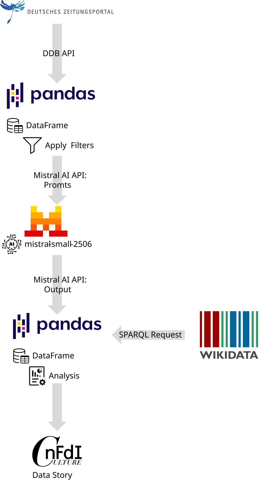
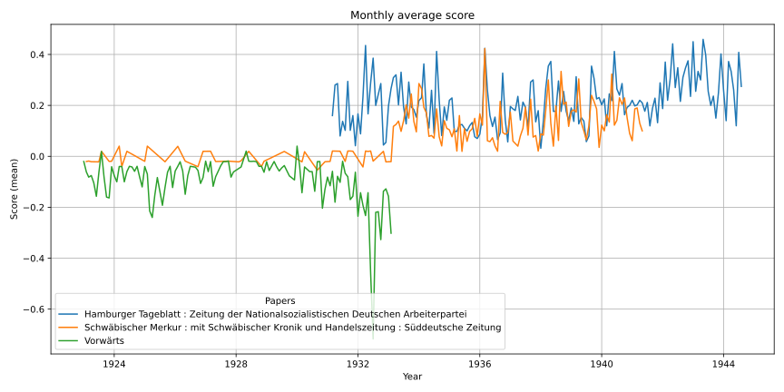
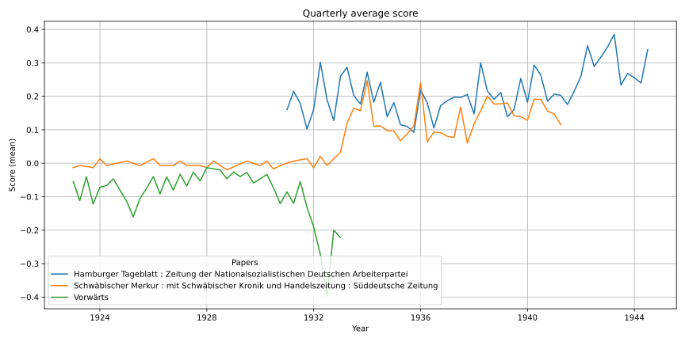

# Abstract

In recent years, the role of journalism in shaping public opinion, particularly in politically sensitive contexts, has drawn renewed attention. Modern debates about media responsibility, misinformation, and the influence of platform owners on public discourse provide a contemporary lens through which historical media coverage can be reexamined. This project draws on the Deutsches Zeitungsportal, a comprehensive archive of historical German newspapers, to investigate how journalism responded to the political transformation in Germany during the early 1930s. Using Large Language Models (LLMs), we aim to analyze and classify the stance of newspaper articles toward the NSDAP, reducing the need for exhaustive manual reading. This approach was motivated by a combination of personal interest in journalism and an initial observation of contradictory reporting surrounding the arrest of an SPD politician, highlighting the potential of computational methods to surface patterns and tensions in historical media landscapes.

# Introduction/Motivation

The [Deutsche Zeitungsportal](https://www.deutsche-digitale-bibliothek.de/newspaper) is run by the German Digital Library and enables free access to numerous historical newspapers from German cultural and scientific institutions. It contains over 1,931 newspapers comprising more than 25 million pages, especially many from the beginning of the 20th century.

<figure>
  <p><a href="https://www.deutsche-digitale-bibliothek.de/assets/dzp-logo-lg-rgb-ef2b5467392b95453fad9602155430d8.svg">
    
  </a></p>
  <figcaption>
    <p>Logo des Deutschen Zeitungsportals
  </figcaption>
</figure>

This rich data source allows for multiple potential analyses, providing, for example, deeper insights into the general public portrayal of political events. However, utilizing such large amounts of data involves an an overwhelming amount of manual effort if done by humans. This is where Large Language Models come in handy. These models are capable of understanding textual context and thus can be utilized to assist in analyzing large numbers of news articles.

The data story focuses on analyzing how historical newspapers positioned themselves toward the NSDAP during its rise in the early 1930s. This focus stems from the central role the party played in shaping Germany’s political landscape and the relevance of understanding how media outlets reported on its activities and ideology. By employing large language models (LLMs) to estimate the sentiment or orientation of articles in relation to the party. This approach allows us to identify how perspectives may have shifted over time, especially around key political and societal events. Rather than interpreting or judging the content, the focus is on detecting patterns in the data to better understand how the press reflected or responded to developments during this pivotal historical period.


# Research questions


1. How did newspaper stances toward the NSDAP change between 1923 and 1945?
2. Can LLMs detect support or criticism of the NSDAP in historical newspapers?
3. How did key political events affect media sentiment toward the NSDAP?


# Methodology& Implementation

The following subsections outline the technical and analytical approach used to assess newspaper articles for their stance toward the NSDAP. After filtering the dataset to identify consistently active newspapers, articles are sampled and analyzed using a large language model. The methodology section details data access and filtering strategies, model selection criteria, and prompt design. Additionally, historical events from WikiData are later aligned with these stance scores to contextualize shifts in sentiment over time.

## Methodology

Currently, there is no SPARQL endpoint in the NFDI4Culture environment for data coming from the [Deutsche Zeitungsportal](https://www.deutsche-digitale-bibliothek.de/newspaper). We therefore call the [DDB API](https://github.com/Deutsche-Digitale-Bibliothek/ddblabs-ddbapi) to access the data. To initially analyze the data and its size, we download all articles published between 1920 and 1945. The full corpus of articles from this period comprises over 160 gigabytes of text, excluding the digitized source materials from which the text was extracted using Optical Character Recognition (OCR). To focus only on relevant data, the downloaded data is then filtered using Pandas Python code. Pandas is a powerful Python library enabling users to process, analyze, and visualize large amounts of data. The refined data is subsequently used to call the large language model of the Mistral AI API (`mistral-small-2506`), which interprets the news articles for stance towards the NSDAP.

<figure>
  <p><a>
    
  </a></p>
  <figcaption>
    <p>Overview of data flow
  </figcaption>
</figure>

## Set Up and Implementation

This section describes how the newspaper dataset was narrowed down to a refine subset. It begins with the filtering criteria used to select consistently active newspapers, followed by a description of the sampled articles. The final parts explain how large language models were applied to assess stance towards NSDAP and how external historical event data was integrated to support the analysis.

### Filters

To refine the dataset to the most consistently active and prolific publishers, only newspapers that were in continuous operation for at least 12 years and published a minimum of 500 articles per year were retained. We chose 12 years since this is the period between the beginning of the data (1920) and the seizure of power by the NSDAP (1933).

Applying these criteria resulted in a selection of 101 newspapers, representing a total data volume of over 29 gigabytes.

<details>
<summary>List of 101 newspapers:</summary>

<br>

1. Sauerländisches Volksblatt : aeltester Anzeiger des Sauerlandes : ueber 100 Jahre Heimat- und Kreisblatt im Kreise Olpe : Tageszeitung für Politik, Unterhaltung und Belehrung
2. Riesaer Tageblatt und Anzeiger : (Elbeblatt und Anzeiger) : amtliche Bekanntmachungen für die Stadt und den Landkreis Riesa
3. Frankenberger Tageblatt, Bezirks-Anzeiger : Amtsblatt für die königliche Amtshauptmannschaft Flöha, das königliche Amtsgericht und den Stadtrat zu Frankenberg i. Sa
4. Der Grafschafter. 1914-1945
5. Schwäbischer Merkur : mit Schwäbischer Kronik und Handelszeitung : Süddeutsche Zeitung
6. Wittener Tageblatt : verbunden mit der Annener Zeitung
7. Velberter Zeitung : Nevigeser Volkszeitung : Heiligenhauser Zeitung
8. Rheinisches Volksblatt : Hildener Zeitung und Tageblatt : Hildener Rundschau
9. Gießener Anzeiger : General-Anzeiger für Oberhessen
10. Mitteldeutsche Nationalzeitung
11. Oberkasseler Zeitung : Heimatzeitung für Oberkassel, Ober- und Niederdollendorf und Römlinghoven
12. Wittener Volks-Zeitung : verbunden mit dem "Wittener Lokal-Anzeiger"
13. Hallische Nachrichten : General-Anzeiger für Halle und die Provinz Sachsen
14. Aachener Anzeiger : politisches Tageblatt : beliebtes und wirksames Anzeigenblatt der Stadt und der Regierungsbezirks
15. Durlacher Tagblatt : Heimatblatt für die Stadt und den früheren Amtsbezirk Durlach; Pfinztäler Bote für Grötzingen, Berghausen, Söllingen, Wöschbach u. Kleinsteinbach
16. Stadtanzeiger für Castrop-Rauxel und Umgebung : Castroper Zeitung, Rauxeler Neueste Nachrichten, Bladenhorster Tageblatt : amtliches Veröffentlichungsblatt für den Landgerichtsbezirk Dortmund, allgemeindes Kreisblatt für den Stadtkreis Castrop-Rauxel
17. Schwerter Zeitung : Heimatblatt für die Stadt Schwerte und die Ämter Westhofen und Ergste : einzige in Schwerte gedruckte Zeitung
18. Dresdner Nachrichten
19. Hamburger Fremdenblatt, Abendausgabe
20. Sächsische Volkszeitung : für christliche Politik und Kultur
21. Eibenstocker Tageblatt : Anzeiger für den Amtsgerichtsbezirk Eibenstock und dessen Umgebung, umfassend die Ortschaften Eibenstock, Blauenthal, Carlsfeld, Hundshübel, Neuheide, Oberstützengrün, Schönheide, Schönheiderhammer, Sosa, Unterstützengrün, Wildenthal, Wilzschhaus, Wolfsgrün usw
22. Wilhelmsburger Zeitung : das Echo der Elbinsel : die Stimme deiner Heimat
23. Der Erft-Bote. 1890-1950
24. Westfälische Zeitung : Bielefelder Tageblatt
25. Kölnische Zeitung. 1803-1945
26. Rhein- und Ruhrzeitung : Tageszeitung für das niederrheinische Industriegebiet und den linken Niederrhein : das Blatt der westdeutschen Binnenschiffahrt
27. Deutscher Reichsanzeiger und Preußischer Staatsanzeiger
28. Erzgebirgischer Volksfreund : mit Schwarzenberger Tageblatt
29. Rheinisch-Bergische Zeitung : Heidersche Zeitung ; ältestes Blatt des Rheinisch-Bergischen Kreises
30. Bergische Post. 1924-1941
31. Honnefer Volkszeitung. 1889-1978
32. Sächsische Elbzeitung : Tageblatt für die Sächsische Schweiz
33. Börsenblatt für den deutschen Buchhandel : bbb ; Fachzeitschr. für Verlagswesen u. Buchhandel
34. Hamburger Tageblatt : Zeitung der Nationalsozialistischen Deutschen Arbeiterpartei
35. Solinger Tageblatt : die Nachmittagszeitung der Klingenstadt : aelteste Tageszeitung im Stadtkreis Solingen
36. Annener Zeitung : verbunden mit der Annener Volkszeitung : Anzeigenblatt für Witten-Annen und die Stadtteile Rüdinghausen, Stockum und Düren
37. Ohligser Anzeiger : Ohligser Zeitung und Tageblatt ; einzige in Ohligs erscheinende Tageszeitung
38. Bergische Wacht. 1907-1941
39. Schwäbischer Merkur ; [...] ; Wochenausgabe für das Ausland
40. Der sächsische Erzähler : Bischofswerdaer Tageblatt ; (Tageblatt für Bischofswerda, Neukirch und Umgebung)
41. Echo des Siebengebirges. 1873-1941
42. General-Anzeiger. 1889-1945
43. Stuttgarter neues Tagblatt : südwestdeutsche Handels- und Wirtschafts-Zeitung
44. Haaner Zeitung. 1928-1941
45. Bergische Landes-Zeitung. 1931-1945
46. Dresdner neueste Nachrichten
47. Marbacher Zeitung : Bottwartal-Bote
48. Zwönitztaler Anzeiger
49. Der Bote vom Geising und Müglitztal-Zeitung : Bezirksanzeiger für Altenberg, Geising, Lauenstein, Bärenstein und die umliegenden Ortschaften
50. Harburger Anzeigen und Nachrichten
51. Neckar-Bote : Heimatzeitung für Seckenheim und Umgebung
52. Bergheimer Zeitung. 1905-1943
53. Internationale Literatur
54. Dresdner Nachrichten, 01-Frühausgabe
55. Merseburger Korrespondent : mitteldeutsche neueste Nachrichten
56. Godesberger Volkszeitung. 1913-1933
57. Niederrheinisches Tageblatt : Kempener Volkszeitung : Kempener Zeitung : Lobbericher Tageblatt : Heimatzeitung für den linken Niederrhein
58. Dortmunder Zeitung. 1874-1939
59. Sächsische Staatszeitung : Staatsanzeiger für den Freistaat Sachsen
60. Bergische Zeitung. 1922-1935
61. Sächsische Dorfzeitung und Elbgaupresse : mit Loschwitzer Anzeiger ; Tageszeitung für das östliche Dresden u. seine Vororte
62. Viernheimer Anzeiger : Viernheimer Zeitung : Viernheimer Tageblatt : Viernheimer Nachrichten : Viernheimer Bürger-Ztg. : Viernh. Volksblatt
63. Central-Volksblatt für das gesamte Sauerland : Arnsberger Zeitung : Sauerländer Bote
64. Duisburger General-Anzeiger. 1914-1935
65. Wochenblatt für Zschopau und Umgegend : Zschopauer Tageblatt u. Anzeiger
66. Riedlinger Zeitung : Tag- und Anzeigeblatt für den Bezirk Riedlingen
67. Echo der Gegenwart. 1848-1935
68. Vorwärts
69. Langenberger Zeitung. 1888-1935
70. Dresdner Nachrichten, 02-Abendausgabe
71. Westfälische neueste Nachrichten mit Bielefelder General-Anzeiger und Handelsblatt
72. Anzeiger vom Oberland : Tageszeitung für das Oberamt Biberach und die Stadtgemeinde Biberach
73. Bottwartal-Bote : Amtsblatt für die Stadt Grossbottwar : Beilsteiner Zeitung, Mundelsheimer Nachrichten, Oberstenfelder Anzeiger
74. Weißeritz-Zeitung : Tageszeitung und Anzeiger für Dippoldiswalde, Schmiedeberg u. U.
75. Sozialdemokrat
76. Der Landbote : Anzeiger für den Amtsbezirk Sinsheim und Umgebung
77. Laupheimer Verkündiger : verbunden mit dem Laupheimer Volksblatt
78. Karlsruher Zeitung
79. Hamburger Volkszeitung : kommunistische Tageszeitung für Hamburg und Umgebung
80. Verbo Schussen-Bote : Oberschw. Morgenblatt
81. Deutsche Reichs-Zeitung. 1871-1934
82. Saale-Zeitung : allgemeine Zeitung für Mitteldeutschland ; Hallesche neueste Nachrichten
83. Der Rottumbote: amtliches und private Anzeigeblatt für Ochsenhausen und Umgebung
84. Hörder Volksblatt. 1884-1934
85. Süddeutsche Zeitung : für deutsche Politik und Volkswirtschaft
86. Die Glocke. 1885-1933
87. Merseburger Tageblatt : Kreisblatt ; mit den amtlichen Bekanntmachungen des Stadt- und Landkreises Merseburg
88. Aufwärts : christliches Tageblatt
89. Iserlohner Kreisanzeiger und Zeitung. 1898-1949
90. Volkswacht : Organ der Sozialdemokratie für das östl. Westfalen und die lippischen Freistaaten
91. Nachrichten für Naunhof und Umgegend : (Albrechtshain, Ammelshain, Beucha, Borsdorf, Eicha, Erdmannshain, Fuchshain, Groß- und Kleinsteinberg, Klinga, Köhra, Lindhardt, Pomßen, Staudnitz, Threna usw.)
92. Bergedorfer Zeitung : unabhängig, überparteilich ; mit amtl. Bekanntmachungen
93. Westdeutsche Landeszeitung : Gladbacher Volkszeitung und Handelsblatt : allgemeiner Anzeiger für den gesamten Niederrhein : die Niederrheinische Heimatzeitung
94. Dorstener Volkszeitung. 1919-1933
95. Rheinisches Volksblatt
96. Hildener Rundschau. 1924-1936
97. Bürener Zeitung. 1896-1935
98. Karlsruher Tagblatt
99. Münsterischer Anzeiger : Westfälischer Merkur : Münsterische Volkszeitung : amtliches Organ des Gaues Westfalen-Nord der NSDAP und sämtlicher Behörden
100. Buchauer Zeitung Volksblatt vom Federsee : Amtsblatt für die städt. Behörden Buchaus
101. Bünder Tageblatt. 1901-1942
</details>

<p></p>
From there, three newspapers were selected manually. For each newspaper, up to 50 articles per month were randomly sampled between 1923-1945, provided that more than 50 articles were available for that month.
<p></p>

1. Schwäbischer Merkur : mit Schwäbischer Kronik und Handelszeitung : Süddeutsche Zeitung
2. Hamburger Tageblatt : Zeitung der Nationalsozialistischen Deutschen Arbeiterpartei  
3. Vorwärts

The remaining 25,234 articles have a size of around 500 megabyte.


### Large Language Model (LLM)

25,234 articles still represent too large an amount to review manually. Therefore, we utilize LLMs to help us understand the stance of an article towards the NSDAP. In the following subsection, we will briefly describe which LLMs were considered and how prompts are set up to receive fitting estimates from the models.

#### Selection

When looking at potential LLMs, we consider different metrics to decide on applicability. These metrics are sorted into high and medium priorities categories and form the basis on which the LLM is selected.

| Metric          | Priorität | Description                                                                                                                                         |
|-----------------|-----------|-----------------------------------------------------------------------------------------------------------------------------------------------------|
| Licence         | medium    | To ensure reproducibility for future researchers, a public and open-source license is desirable.                                                   |
| MMLU            | high      | Since LLMs are faced with understanding sometimes complicated news articles, a high MMLU (LLM benchmark) is important.                             |
| Context Window  | high      | The context window of the prompt is long since it contains the article that the LLM is analyzing. Therefore, a large context window is mandatory. |
| Price           | high      | With long context windows (input tokens), computational effort, and therefore prices, for LLM APIs can quickly become high.                        |


We collected all relevant metrics for the following Large Language Models.

| Modell                           | Licence             | MMLU   | Context Window (token) | Input (M tokens)/($) | Output (M tokens)/($) |
|----------------------------------|----------------------|--------|--------------------------|------------------------|-------------------------|
| Mistral-Nemo-Instruct-2407       | Apache 2 License     | 0.627  | 128,000                  | 0.15                   | 0.15                    |
| Mistral-Small-3.2-24B-Instruct-2506 | Apache 2 License     | 0.805  | 128,000                  | 0.10                   | 0.30                    |
| Magistral-Small-2506             | Apache 2 License     | 0.81   | 128,000                   | 0.50                   | 1.50                    |
| Mistral-7B-v0.1                  | Apache 2 License     | 0.601  | 8,000                    | 0.25                   | 0.25                    |
| GPT-4.1 mini                     | Proprietary License  | 0.875  | 1,047,576                | 0.40                   | 1.60                    |
| GPT-4.1 nano                     | Proprietary License  | 0.801  | 1,047,576                | 0.10                   | 0.40                    |
| Llama 4 Scout API                | Proprietary License  | 0.743  | 327,680                  | 0.18                   | 0.59                    |

The model Mistral-Small-3.2-24B-Instruct-2506 was ultimately selected for the task of analyzing news articles for stance toward the NSDAP. After comparing all available options, including models from the Mistral family with open weights and an Apache 2.0 license, this model offered a compelling balance of performance and cost. With an MMLU score of 0.805, it outperformed smaller variants like Mistral-Nemo and Mistral-7B, while remaining significantly more cost-efficient than larger proprietary alternatives such as GPT-4.1. Its extended context window of 128,000 tokens further supports the processing of long historical articles, making it well-suited for nuanced text classification tasks at scale.


#### Prompt

To instruct the Mistral API, we constructed a prompt that defines the task and provides historical context. The model is asked to evaluate OCR-extracted newspaper articles from the period 1923–1945, focusing on indicators of the article's stance toward the NSDAP. The evaluation is based primarily on keywords reflecting opinion, supplemented by the broader semantics of the text. The output is restricted to a single numerical score to support consistent, automated analysis.

<div style="background-color: #009682; padding: 10px; border: 1px solid #009682; border-radius: 4px;">
<strong>Prompt:</strong> <br> 
You are given an OCR-extracted newspaper article below from the period 1923–1945. Your task is to evaluate accordingly to the metric of criticism towards NSDAP. Primarily base your evaluation on keywords that indicate their opinion towards the NSDAP but also include the semantics of the text. Only return the score without explanation Range: -2 being critical and opposing, 0 being neutral, 2 being supportive towards NSDAP. <br>
article: <br>
{text}
</div>

We configured the language model with the following parameters to balance creativity and coherence while maintaining concise responses: temperature=0.7, top_p=0.9, and max_tokens=124. The max_tokens=124 limit was chosen to constrain the model’s output to a brief and focused response—specifically, a single numerical score as instructed. This helps prevent verbose outputs or explanations, ensuring compatibility with automated processing pipelines and minimizing noise in the scoring data.


### Wiki Data

- @Maren: Hier bitte einmal beschreiben was du technische grob gemacht hast. Also  wie wurden peaks oder trend identifizert und wie lautet unsere SPARQL Code.

HIER SPARQL Anpassen:

```sparql linenums="1" title="Example query"
# List of research data portals
PREFIX fabio: <http://purl.org/spar/fabio/>
PREFIX rdf: <http://www.w3.org/1999/02/22-rdf-syntax-ns#>
PREFIX rdfs: <http://www.w3.org/2000/01/rdf-schema#>
PREFIX nfdicore: <https://nfdi.fiz-karlsruhe.de/ontology/>
PREFIX n4c: <https://nfdi4culture.de/id/>

SELECT (SAMPLE(?resource) AS ?entity) (SAMPLE(?label) AS ?name)
WHERE {
    ?resource rdf:type nfdicore:DataPortal,
      				fabio:Database .
    ?resource rdfs:label ?label .
}
GROUP BY ?resource
ORDER BY ?name
```


# Comparing Data

In total, all 25,234 articles were evaluated by the LLM (Mistral-Small-3.2-24B-Instruct-2506). In 67 cases, the LLM did not only respond with a final score as requested in the prompt, but also with a full-text explanation. We filtered these cases out by only considering responses with five or fewer characters. The remaining 25,164 articles can be divided into the following responses:

| Score                          | Schwäbischer Merkur : mit Schwäbischer Kronik und Handelszeitung : Süddeutsche Zeitung | Hamburger Tageblatt : Zeitung der Nationalsozialistischen Deutschen Arbeiterpartei | Vorwärts | Total  |
|-------------------------------|------------------------------------------------------------------------------------------|--------------------------------------------------------------------------------------|----------|--------|
| >0                            | 665                                                                                      | 1547                                                                                 | 80       | 2292   |
| 0                             | 10289                                                                                    | 6392                                                                                 | 5501     | 22182  |
| <0                            | 78                                                                                       | 92                                                                                   | 520      | 690    |
| **Articles with Scores**                     | 11032                                                                                    | 8031                                                                                 | 6101     | 25164  |
| Answers longer than 5 characters   | 18                                                                                       | 48                                                                                   | 1        | 67     |


The results show clear differences between the publications:

- he Hamburger Tageblatt had the highest share of supportive articles, with approximately 19% scoring above zero, while only about 1% were critical.

- The Schwäbischer Merkur showed a largely neutral tone, with over 93% of its articles scored as zero. A small proportion (~6%) were supportive, and less than 1% critical.

- Vorwärts stood out with the highest proportion of critical content, where over 8% of its articles received a score below zero. Supportive articles were rare (~1%), while 90% were classified neutral.

Overall, 88% of all articles across the three newspapers were classified as neutral, indicating a general absence of explicit political stance or a challenge for the model to detect implicit bias.

All articles were grouped by newspaper and averaged using the arithmetic mean on both a monthly and quarterly basis, with zero values excluded.

<figure>
  <p><a>
    
  </a></p>
  <figcaption>
    <p>Monthly average score plot
  </figcaption>
</figure>

<figure>
  <p><a>
    
  </a></p>
  <figcaption>
    <p>Quarterly average score plot
  </figcaption>
</figure>

## Comparison Over Time and Between Newspapers

When examining the data over time, it becomes clear that not all newspapers reported consistently throughout the entire period. Vorwärts ceased publication after February 28, which aligns with its ban following the Reichstag fire. Similarly, the Schwäbische Merkur stopped publishing after May 1941, though no definitive reason for this discontinuation could be identified. The Hamburger Tagesblatt only began reporting in 1931, so no data is available from earlier years.

Analyzing the trends, Vorwärts generally displayed a more oppositional stance toward the NSDAP. This opposition intensified as the party moved closer to seizing power. The Schwäbische Merkur showed scores near zero before the takeover. However, it remains unclear whether this reflects genuinely neutral reporting, a lack of explicit political positioning, or limitations in the model's ability to detect implicit bias. As such, a score around zero should not be interpreted as definitive neutrality. After the seizure of power, reporting by the Schwäbische Merkur tended to shift above zero, indicating a possible change in tone or alignment.

In the case of the Hamburger Abendblatt, the data reveals a more supportive stance toward the NSDAP. This positive trend continued until the paper ceased publication in August 1944.

## Mapping of Historical Events

- @Maren: Hier bitte kurz deine Peaks und die dazu identifizierien Historischen Events aufzeigen
- Observed a change in reporting after historical events or during them (!Descriptive non-judgmental!)


# Challenges in OCR

OCR (Optical Character Recognition) is a process that converts handwritten or printed text from images into machine-readable text. It is widely used and enables, for example, historians to scan pages of old historical books to extract their text.


[link](https://www.deutsche-digitale-bibliothek.de/newspaper/item/PC26FTJGOJSB5WRMM4MZTEFKGOCRY4VW?query=Der%20Motor&issuepage=1)

The example above demonstrates that printed fonts based on the modern Latin alphabet tend to yield relatively accurate OCR results. In contrast, when processing texts in German Fraktur, recognition errors occur more frequently due to the script's divergence from the Latin alphabet.


[link](https://www.deutsche-digitale-bibliothek.de/newspaper/item/OBFCRDFM4NLVYKD6MDK2IQCIA7SHSBQ6?issuepage=1)

As shown in the image above, the OCR system fails to accurately recognize certain letters. For example, it transforms the original title "Diplomatenempfänge beim Führer" into "Tiptomniedempfunge deim Zahrer." The table below summarizes the character recognition errors made by the OCR program, indicating the incorrect characters and their correct counterparts.
 
| OCR Character | Correct Character | Example Error                  |
|---------------|-------------------|--------------------------------|
| T             | D                 | Tiptomniedempfunge → Diplomatenempfänge |
| i             | l                 | Tiptomniedempfunge → Diplomatenempfänge |
| p             | l                 | Tiptomniedempfunge → Diplomatenempfänge |
| t             | m                 | Tiptomniedempfunge → Diplomatenempfänge |
| n             | a                 | nied → aten                    |
| e             | a                 | empfunge → empfänge            |
| u             | ä                 | empfunge → empfänge            |
| g             | r                 | empfunge → empfänge            |
| d             | b                 | deim → beim                    |
| Z             | F                 | Zahrer → Führer                |
| a             | ü                 | Zahrer → Führer                |

The recognition errors make it difficult to understand the titles obtained from OCR output without access to the original text or its context. This poses a particular challenge for the application of natural language processing (NLP) methods, as incoherent words can significantly impair textual analysis-especially when dealing with linguistically complex or historically nuanced documents.

In this project, we explored a method for detecting and correcting OCR errors using a dictionary-based approach. When an unrecognized word was found, the surrounding sentence was sent to a LLM, which returned a corrected version of the word. Both the erroneous and corrected words were stored so that repeated errors could be resolved without querying the LLM again, which helped reduce overall API usage.

<div style="background-color: #009682; padding: 10px; border: 1px solid #009682; border-radius: 4px;">
<strong>Prompt:</strong> <br>
Correct the misrecognized word '{word}' in the German sentence: '{s}'.
Only return the replacement word. 
</div>

Ultimately, this approach was not continued due to the increasing cost of LLM API requests. At the same time, new OCR tools were introduced that showed promising improvements in handling historical German scripts such as Fraktur, especially when fine-tuned for the task.


# Discussion and Conclusion

This project demonstrates the potential of using modern Large Language Models (LLMs) to explore and interpret large volumes of historical newspaper content. By combining filtered historical data from the Deutsches Zeitungsportal with automated stance classification toward the NSDAP, we were able to identify broad patterns and temporal shifts in press positioning during one of Germany’s most politically transformative periods.

Despite its promise, the approach also highlights several limitations that must be addressed in future work. The reliability of the OCR-based text sources is one key challenge. Text recognition errors, ranging from simple spelling mistakes to corrupted passages, can impair model understanding and lead to misclassification or neutral (zero) scores. This introduces uncertainty and calls for robust preprocessing and post-evaluation validation methods.

Additionally, the difficulty in assessing the quality and accuracy of LLM-generated stance scores remains unresolved. Without a well-defined ground truth or a scalable way to conduct qualitative spot checks, it is hard to gauge whether the results reflect genuine historical sentiment or are artifacts of data noise and model interpretation. While the selected model offered a good balance of cost, performance, and context window, it may still struggle with subtle forms of political rhetoric, implicit bias, or historical language usage.

Nevertheless, the approach has shown that LLMs can be valuable tools in historical media analysis, especially for scaling initial explorations across large datasets. It can enable historians, researchers, and the public to surface trends, identify anomalies, and formulate more focused research questions. Future extensions might include more sophisticated OCR error correction, model fine-tuning on historical German language, and closer integration of event data to improve interpretability.

In short, while fully automated historical interpretation remains a complex goal, this work demonstrates a promising step toward computationally assisted historiography.
