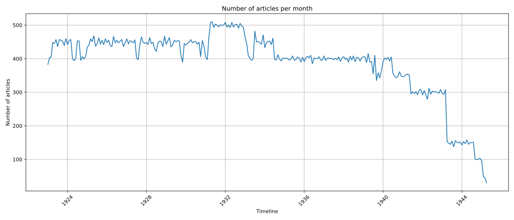
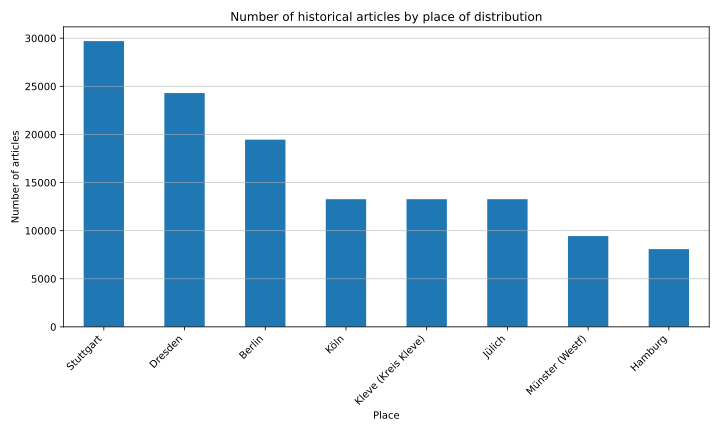

# Another Story

## In this story, we review the OCR text quality of news articles from the Nazi era and derive a metric that scores the perspective of the article towards the Nazi regime.

 **Abstract:** The Data Story utilizes news articles from the period 1920–1945, during which the Nazi party (NSDAP) rose to power. In the first chapters, the Data Story examines data from the [Deutsche Zeitungsportal](https://www.deutsche-digitale-bibliothek.de/newspaper) and evaluates its quality, especially the quality of the Optical Character Recognition (OCR) text. It identifies major issues in OCR text quality, resulting mainly from the limited capability of OCR to read old German fonts (Fraktur). Different methods of resolving this issue are discussed. In the following chapters, the text derives a metric to score the news articles based on their perspective toward the Nazi regime - scoring them in terms of approval or disapproval. The Data Story then clusters different news articles and major newspapers, visualizing their aggregated scores as derived from the published articles. In the final chapters, outliers are analyzed by linking them to historical events derived from the data source ???(tbd).


## Introduction


## Research questions
The Research question are seperated in two diffrent blocks:

**Noise**

1. How can noise/errors in the OCR text be defined and measured?
2. How can noise/errors in the OCR text be handled and mitigated?

**Scoring**

1. What are the relevant articles to determine what stance a newspaper had toward the NS regime?
2. What are the criteria to define what stance an article had toward the NS regime?
3. How can the stance toward the NS regime be quantified?

As methodology Artifcial Inteligence (AI) based approaches such as Large Language Models (LLMs) are used to quantify OCR text quality and drive scores to quantify articles regarding their perspective. These scoring systems included Models such as distilgpt2, dbmdz/german-gpt2, google/byt5-small and bert-base-german-cased.

[//]: <  >


<div style="background-color: #fff3cd; padding: 10px; border: 1px solid #ffeeba; border-radius: 4px;">
<strong>Hinweis:</strong> Das Bild ist ein Platzhalter für unsere Darstellung, wie die Daten fließen.
</div>


## OCR and its potential errors

OCR (Optical Character Recognition) is a process that converts handwritten or printed text from images into machine-readable text. It is widely used and enables, for example, historians to scan pages of old historical books to extract their text.


[link](https://www.deutsche-digitale-bibliothek.de/newspaper/item/PC26FTJGOJSB5WRMM4MZTEFKGOCRY4VW?query=Der%20Motor&issuepage=1)

The example above demonstrates that printed fonts based on the modern Latin alphabet tend to yield relatively accurate OCR results. In contrast, when processing texts in German Fraktur, recognition errors occur more frequently due to the script's divergence from the Latin alphabet.


[link](https://www.deutsche-digitale-bibliothek.de/newspaper/item/OBFCRDFM4NLVYKD6MDK2IQCIA7SHSBQ6?issuepage=1)

As shown in the image above, the OCR system fails to accurately recognize certain letters. For example, it transforms the original title "Diplomatenempfänge beim Führer" into "Tiptomniedempfunge deim Zahrer." The table below summarizes the character recognition errors made by the OCR program, indicating the incorrect characters and their correct counterparts.
 
| OCR Character | Correct Character | Example Error                  |
|---------------|-------------------|--------------------------------|
| T             | D                 | Tiptomniedempfunge → Diplomatenempfänge |
| i             | l                 | Tiptomniedempfunge → Diplomatenempfänge |
| p             | l                 | Tiptomniedempfunge → Diplomatenempfänge |
| t             | m                 | Tiptomniedempfunge → Diplomatenempfänge |
| n             | a                 | nied → aten                    |
| e             | a                 | empfunge → empfänge            |
| u             | ä                 | empfunge → empfänge            |
| g             | r                 | empfunge → empfänge            |
| d             | b                 | deim → beim                    |
| Z             | F                 | Zahrer → Führer                |
| a             | ü                 | Zahrer → Führer                |

The recognition errors make it difficult to understand the titles obtained from OCR output without access to the original text or its context. This poses a particular challenge for the application of natural language processing (NLP) methods, as incoherent words can significantly impair textual analysis-especially when dealing with linguistically complex or historically nuanced documents.

In the following two subchapters, the data storie evaluates methods for estimating OCR text quality in materials obtained from the Deutsches Zeitungsportal during the period 1920–1945. Begin by examining potential metrics for measuring OCR errors and identifying the challenges involved in their application.

### Potential metrics measuring errors

When analyzing OCR output, most evaluation methods rely on metrics that compute precision, such as:

$$
\text{Precision} = \frac{\text{True Positives}}{\text{True Positives} + \text{False Positives}}
$$

These metrics depend on a crucial prerequisite: the availability of a ground truth that defines the correct version of the text. Without such a reference, it is impossible to determine which tokens or characters are true positives or false positives.

Due to the extensive volume of articles, a corresponding ground truth is not available, rendering manual annotation infeasible. Consequently, this Datastorie employs perplexity as a heuristic metric to evaluate the relative quality of textual data across different historical periods.

Perplexity measures the confidence of a NLP in predicting subsequent tokens within a text. Lower perplexity values can correlate with higher text quality. To illustrate, consider the following example from 1936: _"Diplomatenempfänge beim..."_ ("Diplomatic receptions at the..."), compared to a distorted version: _"Tiptomniedempfunge deim..."_. 

As most readers would find it easier to predict the next word in the clearer phrase, a language model similarly exhibits higher confidence, reflected by lower perplexity, when processing less degraded, more coherent text. Thus, perplexity serves as a practical, though indirect, proxy for text quality in the absence of annotated ground truth.

It is important to note that perplexity remains a heuristic measure, as next-token prediction confidence also depends on how effectively a language model interprets textual context. Linguistically complex texts-such as newspaper from historical periods containing unconventional language use may yield elevated perplexity scores, despite being of high OCR text quality.

Nevertheless, perplexity provides a useful and consistent proxy for evaluating relative text quality when annotated ground truth is unavailable.

### OCR text quality

The perplexity in this data story was derived using the following language models from Hugging Face: `distilgpt2`, `dbmdz/german-gpt2`, `google/byt5-small`, and `bert-base-german-cased`.

```
def get_perplexity(text: str):
    inputs = tokenizer(text, return_tensors="pt", truncation=True, max_length=512)
    input_ids = inputs["input_ids"].to(device) 
    with torch.no_grad():
        outputs = model(input_ids, labels=input_ids)
        loss = outputs.loss
    return torch.exp(loss).item()
```

For each sampled text snippet (up to 512 tokens), the model was evaluated in inference mode, comparing the input sequence against itself as the prediction target. Internally, the model computes the cross-entropy loss over the token sequence, but instead of returning individual token-level losses, it uses the average loss over all tokens in the snippet. This average loss is then exponentiated to yield a single perplexity score per text snippet:

$$
Perplexity(x)=exp(L(x))
$$

where $L(x)$ is the mean negative log-likelihood across the tokens in the snippet $x$.

To use computing resources efficiently, perplexity was computed over the period January to May 1933, and from that set, $1.5\%$ was randomly selected for evaluation.

As mentioned in section [OCR and its potential errors](#ocr-and-its-potential-errors), OCR text from post-war newspapers is assumed to have higher accuracy, as most articles are written in the classical Latin alphabet. Therefore, articles from the period 1980–1994 were used, with $20\%$ of that set selected to compute perplexity.

Note that, due to copyright constraints, more articles from 1933 are available than from 1980–1994. This explains the difference in sampling rates between the two periods.

<div style="background-color: #fff3cd; padding: 10px; border: 1px solid #ffeeba; border-radius: 4px;">
<strong>Hinweis:</strong> Zum aktuellen Zeitpunkt (06/2025) wurde die Perplexity so ausgerechnet. Eine größere Stichprobe könnte bei Bedarf erneut durchgeführt werden
</div>

| Model             | 1933 Period (01/1933–05/1933) | 1980–1994 Period (01/1980–05/1994) | Ratio |
| ----------------- | ----------------------------- | ---------------------------------- | ----- |
| distilgpt2        | 195.37                        | 132.82                             | 1.47  |
| dbmdz/german-gpt2 | 236.74                        | 91.34                              | 2.58  |
| google/byt5-small | 1,971,675.58                  | 552,495.41                         | 3.57  |

The substantial increase in perplexity for the 1933 dataset compared to the 1980–1994 dataset suggests that data quality, such as OCR errors, may significantly affect language model performance. However, as already discussed in section [OCR and its potential errors](#ocr-and-its-potential-errors), this may also result from the language model, which may understand fewer historical contexts.

## Quantifying the perspective of a news article distorts the Nazi regime

### Data scope

This data study investigates newspaper articles published between 1920 and 1945. The full corpus of articles from this period comprises over 160 gigabytes of text, excluding the digitized source materials from which the text was extracted using OCR.

To refine the dataset to the most consistently active and prolific publishers, only newspapers that were in continuous operation for at least 12 years and published a minimum of 500 articles per year were retained.

Applying these criteria resulted in a selection of 101 newspapers, representing a total data volume of over 29 gigabytes.

1. Sauerländisches Volksblatt : aeltester Anzeiger des Sauerlandes : ueber 100 Jahre Heimat- und Kreisblatt im Kreise Olpe : Tageszeitung für Politik, Unterhaltung und Belehrung
2. Riesaer Tageblatt und Anzeiger : (Elbeblatt und Anzeiger) : amtliche Bekanntmachungen für die Stadt und den Landkreis Riesa
3. Frankenberger Tageblatt, Bezirks-Anzeiger : Amtsblatt für die königliche Amtshauptmannschaft Flöha, das königliche Amtsgericht und den Stadtrat zu Frankenberg i. Sa
4. Der Grafschafter. 1914-1945
5. Schwäbischer Merkur : mit Schwäbischer Kronik und Handelszeitung : Süddeutsche Zeitung
6. Wittener Tageblatt : verbunden mit der Annener Zeitung
7. Velberter Zeitung : Nevigeser Volkszeitung : Heiligenhauser Zeitung
8. Rheinisches Volksblatt : Hildener Zeitung und Tageblatt : Hildener Rundschau
9. Gießener Anzeiger : General-Anzeiger für Oberhessen
10. Mitteldeutsche Nationalzeitung
11. Oberkasseler Zeitung : Heimatzeitung für Oberkassel, Ober- und Niederdollendorf und Römlinghoven
12. Wittener Volks-Zeitung : verbunden mit dem "Wittener Lokal-Anzeiger"
13. Hallische Nachrichten : General-Anzeiger für Halle und die Provinz Sachsen
14. Aachener Anzeiger : politisches Tageblatt : beliebtes und wirksames Anzeigenblatt der Stadt und der Regierungsbezirks
15. Durlacher Tagblatt : Heimatblatt für die Stadt und den früheren Amtsbezirk Durlach; Pfinztäler Bote für Grötzingen, Berghausen, Söllingen, Wöschbach u. Kleinsteinbach
16. Stadtanzeiger für Castrop-Rauxel und Umgebung : Castroper Zeitung, Rauxeler Neueste Nachrichten, Bladenhorster Tageblatt : amtliches Veröffentlichungsblatt für den Landgerichtsbezirk Dortmund, allgemeindes Kreisblatt für den Stadtkreis Castrop-Rauxel
17. Schwerter Zeitung : Heimatblatt für die Stadt Schwerte und die Ämter Westhofen und Ergste : einzige in Schwerte gedruckte Zeitung
18. Dresdner Nachrichten
19. Hamburger Fremdenblatt, Abendausgabe
20. Sächsische Volkszeitung : für christliche Politik und Kultur
21. Eibenstocker Tageblatt : Anzeiger für den Amtsgerichtsbezirk Eibenstock und dessen Umgebung, umfassend die Ortschaften Eibenstock, Blauenthal, Carlsfeld, Hundshübel, Neuheide, Oberstützengrün, Schönheide, Schönheiderhammer, Sosa, Unterstützengrün, Wildenthal, Wilzschhaus, Wolfsgrün usw
22. Wilhelmsburger Zeitung : das Echo der Elbinsel : die Stimme deiner Heimat
23. Der Erft-Bote. 1890-1950
24. Westfälische Zeitung : Bielefelder Tageblatt
25. Kölnische Zeitung. 1803-1945
26. Rhein- und Ruhrzeitung : Tageszeitung für das niederrheinische Industriegebiet und den linken Niederrhein : das Blatt der westdeutschen Binnenschiffahrt
27. Deutscher Reichsanzeiger und Preußischer Staatsanzeiger
28. Erzgebirgischer Volksfreund : mit Schwarzenberger Tageblatt
29. Rheinisch-Bergische Zeitung : Heidersche Zeitung ; ältestes Blatt des Rheinisch-Bergischen Kreises
30. Bergische Post. 1924-1941
31. Honnefer Volkszeitung. 1889-1978
32. Sächsische Elbzeitung : Tageblatt für die Sächsische Schweiz
33. Börsenblatt für den deutschen Buchhandel : bbb ; Fachzeitschr. für Verlagswesen u. Buchhandel
34. Hamburger Tageblatt : Zeitung der Nationalsozialistischen Deutschen Arbeiterpartei
35. Solinger Tageblatt : die Nachmittagszeitung der Klingenstadt : aelteste Tageszeitung im Stadtkreis Solingen
36. Annener Zeitung : verbunden mit der Annener Volkszeitung : Anzeigenblatt für Witten-Annen und die Stadtteile Rüdinghausen, Stockum und Düren
37. Ohligser Anzeiger : Ohligser Zeitung und Tageblatt ; einzige in Ohligs erscheinende Tageszeitung
38. Bergische Wacht. 1907-1941
39. Schwäbischer Merkur ; [...] ; Wochenausgabe für das Ausland
40. Der sächsische Erzähler : Bischofswerdaer Tageblatt ; (Tageblatt für Bischofswerda, Neukirch und Umgebung)
41. Echo des Siebengebirges. 1873-1941
42. General-Anzeiger. 1889-1945
43. Stuttgarter neues Tagblatt : südwestdeutsche Handels- und Wirtschafts-Zeitung
44. Haaner Zeitung. 1928-1941
45. Bergische Landes-Zeitung. 1931-1945
46. Dresdner neueste Nachrichten
47. Marbacher Zeitung : Bottwartal-Bote
48. Zwönitztaler Anzeiger
49. Der Bote vom Geising und Müglitztal-Zeitung : Bezirksanzeiger für Altenberg, Geising, Lauenstein, Bärenstein und die umliegenden Ortschaften
50. Harburger Anzeigen und Nachrichten
51. Neckar-Bote : Heimatzeitung für Seckenheim und Umgebung
52. Bergheimer Zeitung. 1905-1943
53. Internationale Literatur
54. Dresdner Nachrichten, 01-Frühausgabe
55. Merseburger Korrespondent : mitteldeutsche neueste Nachrichten
56. Godesberger Volkszeitung. 1913-1933
57. Niederrheinisches Tageblatt : Kempener Volkszeitung : Kempener Zeitung : Lobbericher Tageblatt : Heimatzeitung für den linken Niederrhein
58. Dortmunder Zeitung. 1874-1939
59. Sächsische Staatszeitung : Staatsanzeiger für den Freistaat Sachsen
60. Bergische Zeitung. 1922-1935
61. Sächsische Dorfzeitung und Elbgaupresse : mit Loschwitzer Anzeiger ; Tageszeitung für das östliche Dresden u. seine Vororte
62. Viernheimer Anzeiger : Viernheimer Zeitung : Viernheimer Tageblatt : Viernheimer Nachrichten : Viernheimer Bürger-Ztg. : Viernh. Volksblatt
63. Central-Volksblatt für das gesamte Sauerland : Arnsberger Zeitung : Sauerländer Bote
64. Duisburger General-Anzeiger. 1914-1935
65. Wochenblatt für Zschopau und Umgegend : Zschopauer Tageblatt u. Anzeiger
66. Riedlinger Zeitung : Tag- und Anzeigeblatt für den Bezirk Riedlingen
67. Echo der Gegenwart. 1848-1935
68. Vorwärts
69. Langenberger Zeitung. 1888-1935
70. Dresdner Nachrichten, 02-Abendausgabe
71. Westfälische neueste Nachrichten mit Bielefelder General-Anzeiger und Handelsblatt
72. Anzeiger vom Oberland : Tageszeitung für das Oberamt Biberach und die Stadtgemeinde Biberach
73. Bottwartal-Bote : Amtsblatt für die Stadt Grossbottwar : Beilsteiner Zeitung, Mundelsheimer Nachrichten, Oberstenfelder Anzeiger
74. Weißeritz-Zeitung : Tageszeitung und Anzeiger für Dippoldiswalde, Schmiedeberg u. U.
75. Sozialdemokrat
76. Der Landbote : Anzeiger für den Amtsbezirk Sinsheim und Umgebung
77. Laupheimer Verkündiger : verbunden mit dem Laupheimer Volksblatt
78. Karlsruher Zeitung
79. Hamburger Volkszeitung : kommunistische Tageszeitung für Hamburg und Umgebung
80. Verbo Schussen-Bote : Oberschw. Morgenblatt
81. Deutsche Reichs-Zeitung. 1871-1934
82. Saale-Zeitung : allgemeine Zeitung für Mitteldeutschland ; Hallesche neueste Nachrichten
83. Der Rottumbote: amtliches und private Anzeigeblatt für Ochsenhausen und Umgebung
84. Hörder Volksblatt. 1884-1934
85. Süddeutsche Zeitung : für deutsche Politik und Volkswirtschaft
86. Die Glocke. 1885-1933
87. Merseburger Tageblatt : Kreisblatt ; mit den amtlichen Bekanntmachungen des Stadt- und Landkreises Merseburg
88. Aufwärts : christliches Tageblatt
89. Iserlohner Kreisanzeiger und Zeitung. 1898-1949
90. Volkswacht : Organ der Sozialdemokratie für das östl. Westfalen und die lippischen Freistaaten
91. Nachrichten für Naunhof und Umgegend : (Albrechtshain, Ammelshain, Beucha, Borsdorf, Eicha, Erdmannshain, Fuchshain, Groß- und Kleinsteinberg, Klinga, Köhra, Lindhardt, Pomßen, Staudnitz, Threna usw.)
92. Bergedorfer Zeitung : unabhängig, überparteilich ; mit amtl. Bekanntmachungen
93. Westdeutsche Landeszeitung : Gladbacher Volkszeitung und Handelsblatt : allgemeiner Anzeiger für den gesamten Niederrhein : die Niederrheinische Heimatzeitung
94. Dorstener Volkszeitung. 1919-1933
95. Rheinisches Volksblatt
96. Hildener Rundschau. 1924-1936
97. Bürener Zeitung. 1896-1935
98. Karlsruher Tagblatt
99. Münsterischer Anzeiger : Westfälischer Merkur : Münsterische Volkszeitung : amtliches Organ des Gaues Westfalen-Nord der NSDAP und sämtlicher Behörden
100. Buchauer Zeitung Volksblatt vom Federsee : Amtsblatt für die städt. Behörden Buchaus
101. Bünder Tageblatt. 1901-1942


From there, 10 newspapers were selected manually. For each newspaper, up to 50 articles per month were randomly sampled between 1923-1945, provided that more than 50 articles were available for that month.

1. Kölnische Zeitung. 1803-1945  
2. Deutscher Reichsanzeiger und Preußischer Staatsanzeiger  
3. Vorwärts  
4. Hamburger Tageblatt : Zeitung der Nationalsozialistischen Deutschen Arbeiterpartei  
5. Münsterischer Anzeiger : Westfälischer Merkur : Münsterische Volkszeitung : amtliches Organ des Gaues Westfalen-Nord der NSDAP und sämtlicher Behörden  
6. Süddeutsche Zeitung : für deutsche Politik und Volkswirtschaft  
7. Stuttgarter neues Tagblatt : südwestdeutsche Handels- und Wirtschafts-Zeitung  
8. Dresdner Nachrichten  
9. Dresdner neueste Nachrichten  
10. Schwäbischer Merkur : mit Schwäbischer Kronik und Handelszeitung : Süddeutsche Zeitung  

The remaining 104.236 articles have a size of around 2.2 gigabytes.






### Model...


## Summary

## With a SPARQL query

```sparql linenums="1" title="Example query"
# List of research data portals
PREFIX fabio: <http://purl.org/spar/fabio/>
PREFIX rdf: <http://www.w3.org/1999/02/22-rdf-syntax-ns#>
PREFIX rdfs: <http://www.w3.org/2000/01/rdf-schema#>
PREFIX nfdicore: <https://nfdi.fiz-karlsruhe.de/ontology/>
PREFIX n4c: <https://nfdi4culture.de/id/>

SELECT (SAMPLE(?resource) AS ?entity) (SAMPLE(?label) AS ?name)
WHERE {
    ?resource rdf:type nfdicore:DataPortal,
      				fabio:Database .
    ?resource rdfs:label ?label .
}
GROUP BY ?resource
ORDER BY ?name
```
